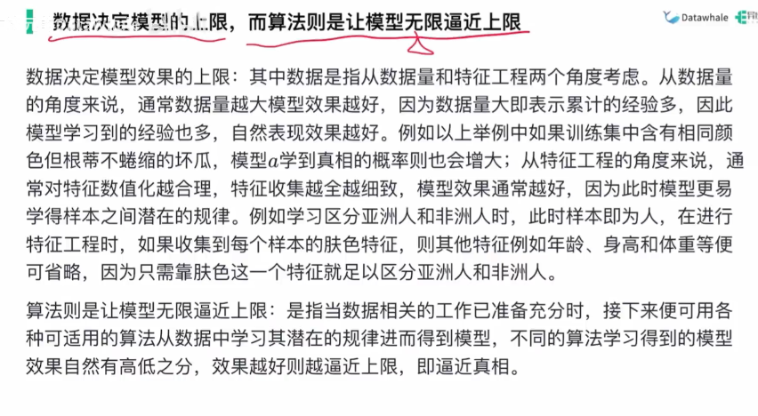

# 绪论

## 基本术语

- 数据集
- 示例/样本，也称为特征向量
- 属性/特征
- 属性值
- 属性空间/样本空间/输入空间
- 训练数据
- 训练样本
- 训练集
- 学习器（learner）
- 标记（lable）
- 样例（example），即有了标记信息的示例
- 标记空间（lable space）/输出空间
- 分类，学习任务预测的是离散值
- 回归，预测的是连续值
- 测试
- 测试样本
- 预测标记
- 监督学习，分类和回归
- 无监督学习
- 泛化

## 假设空间

- 归纳，从特殊到一般的泛化
- 演绎，从一般到特殊的特化
- 记住训练样本，就是所谓的机械学习
- 版本空间，存在着一个与训练集一致的假设集合

## 归纳偏好

- 归纳偏好，机器学习算法在学习过程中对某种类型假设的偏好
- 尽可能特殊，指适用情形尽可能少
- 尽可能一般，指适用情形尽可能多
- 机器学习中对特征的选择是基于对于训练样本分析进行的
- 任何一个有效的机器学习算法必有其归纳偏好，否则它将被假设空间中看似在训练集上“等效”的假设所迷惑，而无法产生确定的学习结果
- 归纳偏好可看做学习算法自身在一个可能很庞大的假设空间中对假设进行选择的启发式或价值观
- 奥卡姆剃刀原则：若有多个假设与观察一致，则选最简单的那个
- 没有免费的午餐，众算法生而平等，在实际应用上：哪个算法训出来的模型在测试集上表现好哪个算法就nb
  

## 发展历程

## 应用现状
