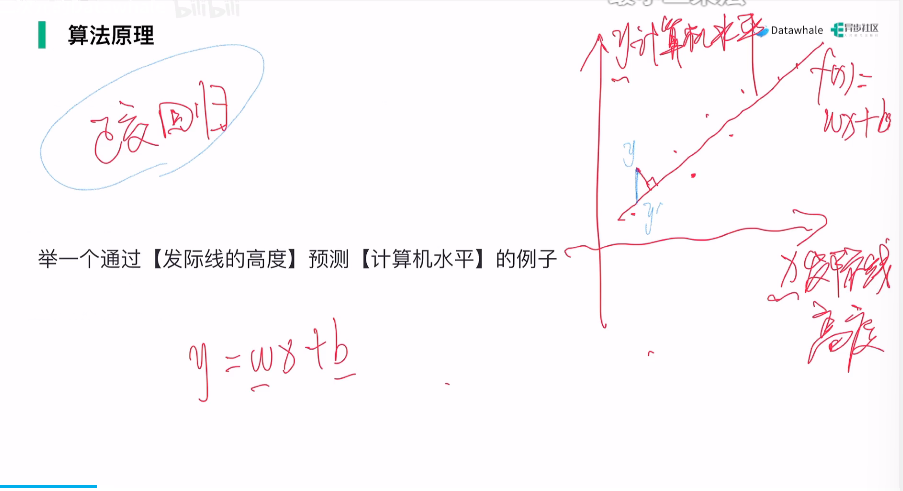
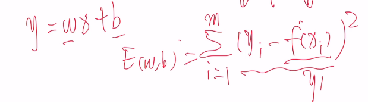
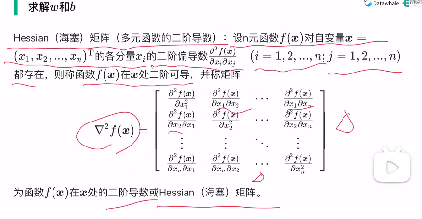
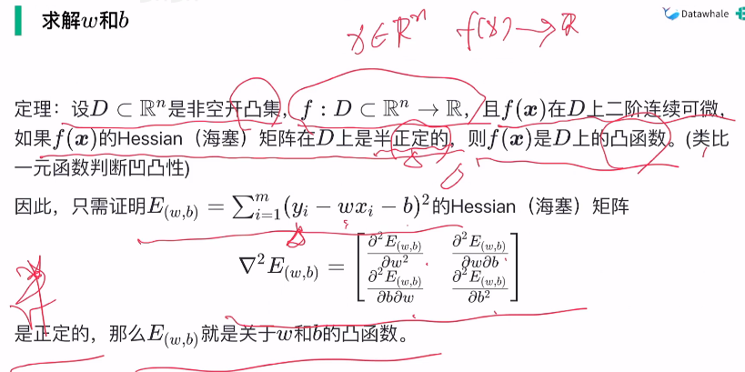
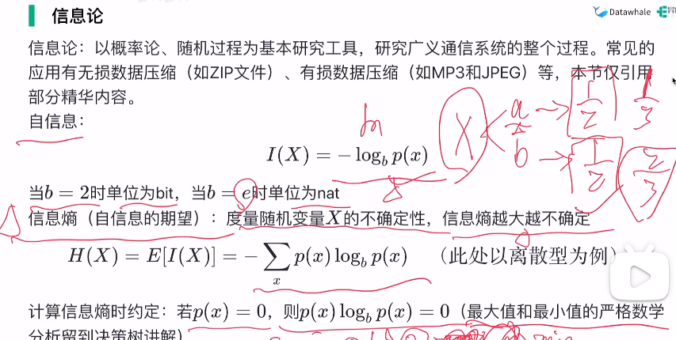
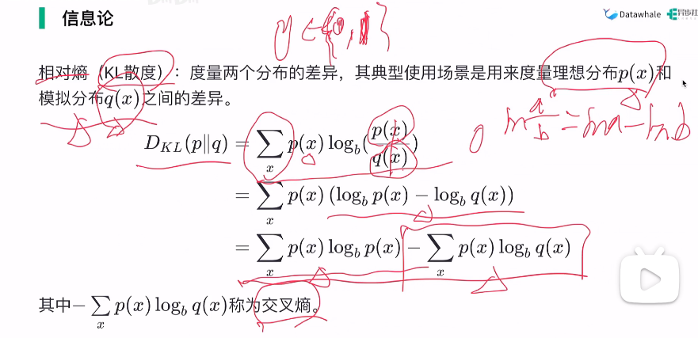
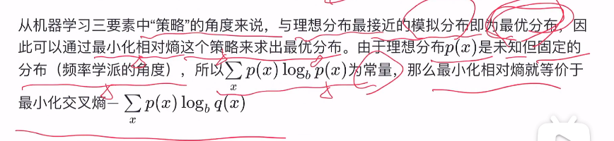
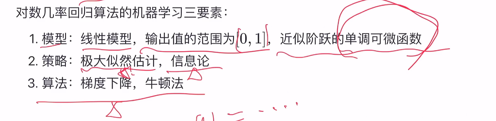

# 线性模型

- 线性模型最基础，支持向量机和神经网络都有线性模型的影子
- 线性回归、对数几率回归、线性判别分析
- 特征工程，属性数值化
- $$
  w=\frac{\sum_{i=1}^{m}y_i(x_i-\bar{x})}{\sum_{i=1}^{m}x_i^2-\frac{1}{m}(\sum_{i=1}^{m}x_i)^2}
  $$
- 
- 正交回归，点到直线距离
- 线性回归，点过与y轴平行线到直线距离
- 均方误差
- 
- 最小二乘估计
- 
- 

机器学习三要素：

1. 模型：根据具体问题，确定假设空间
2. 策略：根据评价标准，确定选取最优模型的策略（通常会产出损失函数）
3. 算法：求解损失函数，确定最优模型

