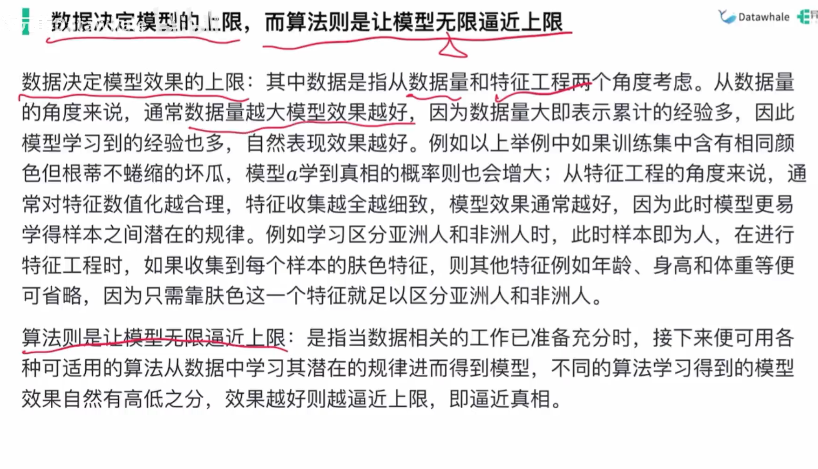

```{important}
参与组队学习的同学须知：

本章学习时间：1.5天

本章配套视频教程：https://www.bilibili.com/video/BV1Mh411e7VU?p=2
```

# 第1章 绪论

本章作为"西瓜书"的开篇，主要讲解什么是机器学习以及机器学习的相关数学符号，为后续内容作铺垫，并未涉及复杂的算法理论，因此阅读本章时只需耐心梳理清楚所有概念和数学符号即可。此外，在阅读本章前建议先阅读==西瓜书目录前页的《主要符号表》==，它能解答在阅读"西瓜书"过程中产生的大部分对数学符号的疑惑。

本章也作为本书的开篇，笔者在此赘述一下本书的撰写初衷，本书旨在以"过来人"的视角陪读者一起阅读"西瓜书"，尽力帮读者消除阅读过程中的"数学恐惧"，只要读者学习过《高等数学》、《线性代数》和《概率论与数理统计》这三门大学必修的数学课，均能看懂本书对西瓜书中的公式所做的解释和推导，同时也能体会到这三门数学课在机器学习上碰撞产生的"数学之美"。

## 1.1 引言

本节以概念理解为主，在此对"算法"和"模型"作补充说明。"算法"是指从数据中学得"模型"的具体方法，例如后续章节中将会讲述的线性回归、对数几率回归、决策树等。"算法"产出的结果称为"模型"，通常是具体的函数或者可抽象地看作为函数，例如一元线性回归算法产出的模型即为形如$f(x)=wx+b$的一元一次函数。不过由于严格区分这两者的意义不大，因此多数文献和资料会将其混用，当遇到这两个概念时，其具体指代根据上下文判断即可。

## 1.2 基本术语

本节涉及的术语较多且很多术语都有多个称呼，下面梳理各个术语，并将最常用的称呼加粗标注。

**样本**：也称为"示例"，是关于一个事件或对象的描述。因为要想让计算机能对现实生活中的事物进行机器学习，必须先将其抽象为计算机能理解的形式，计算机最擅长做的就是进行数学运算，因此考虑如何将其抽象为某种数学形式。显然，线性代数中的向量就很适合，因为任何事物都可以由若干"特征"（或称为"属性"）唯一刻画出来，而向量的各个维度即可用来描述各个特征。例如，如果用色泽、根蒂和敲声这3个特征来刻画西瓜，那么一个"色泽青绿，根蒂蜷缩，敲声清脆"的西瓜用向量来表示即为$\boldsymbol{x}=(\text{青绿};\text{蜷缩};\text{清脆})$ **（向量中的元素用分号";"分隔时表示此向量为列向量，用逗号","分隔时表示为行向量）**，其中青绿、蜷缩和清脆分别对应为相应特征的取值，也称为"属性值"。显然，用中文书写向量的方式不够"数学"，因此需要将属性值进一步数值化，具体例子参见"西瓜书"第3章3.2。此外，仅靠以上3个特征来刻画西瓜显然不够全面细致，因此还需要扩展更多维度的特征，一般称此类与特征处理相关的工作为"特征工程"。

**样本空间**：也称为"输入空间"或"属性空间"。由于样本采用的是标明各个特征取值的"特征向量"来进行表示，根据线性代数的知识可知，有向量便会有向量所在的空间，因此称表示样本的特征向量所在的空间为样本空间，通常用花式大写的$\mathcal{X}$表示。

**数据集**：数据集通常用集合来表示，令集合$D=\{\boldsymbol{x}_{1},\boldsymbol{x}_{2},...,\boldsymbol{x}_{m}\}$表示包含$m$个样本的数据集，一般同一份数据集中的每个样本都含有相同个数的特征，假设此数据集中的每个样本都含有$d$个特征，则第$i$个样本的数学表示为$d$维向量：$\boldsymbol{x}_{i}=(x_{i1};x_{i2};...;x_{id})$，其中$x_{ij}$表示样本$\boldsymbol{x}_{i}$在第$j$个属性上的取值。

**模型**：机器学习的一般流程如下：首先收集若干样本（假设此时有100个），然后将其分为训练样本（80个）和测试样本（20个），其中80个训练样本构成的集合称为"训练集"，20个测试样本构成的集合称为"测试集"，接着选用某个机器学习算法，让其在训练集上进行"学习"（或称为"训练"），然后产出得到"模型"（或称为"学习器"），最后用测试集来测试模型的效果。执行以上流程时，表示我们已经默认样本的背后是存在某种潜在的规律，我们称这种潜在的规律为"真相"或者"真实"，例如样本是一堆好西瓜和坏西瓜时，我们默认的便是好西瓜和坏西瓜背后必然存在某种规律能将其区分开。当我们应用某个机器学习算法来学习时，产出得到的模型便是该算法所找到的它自己认为的规律，由于该规律通常并不一定就是所谓的真相，所以也将其称为"假设"。通常机器学习算法都有可配置的参数，同一个机器学习算法，使用不同的参数配置或者不同的训练集，训练得到的模型通常都不同。

**标记**：上文提到机器学习的本质就是在学习样本在某个方面的表现是否存在潜在的规律，我们称该方面的信息为"标记"。例如在学习西瓜的好坏时，"好瓜"和"坏瓜"便是样本的标记。一般第$i$个样本的标记的数学表示为$y_i$，标记所在的空间称为"标记空间"或"输出空间"，数学表示为花式大写的$\mathcal{Y}$。标记通常也看作为样本的一部分，因此，一个完整的样本通常表示为$(\boldsymbol{x}, y)$。

根据标记的取值类型不同，可将机器学习任务分为以下两类：

- 当标记取值为离散型时，称此类任务为"分类"，例如学习西瓜是好瓜还是坏瓜、学习猫的图片是白猫还是黑猫等。当分类的类别只有两个时，称此类任务为"二分类"，通常称其中一个为"正类"，另一个为"反类"或"负类"；当分类的类别超过两个时，称此类任务为"多分类"。由于标记也属于样本的一部分，通常也需要参与运算，因此也需要将其数值化，例如对于二分类任务，通常将正类记为$1$，反类记为$0$，即$\mathcal{Y}=\{0,1\}$。这只是一般默认的做法，具体标记该如何数值化可根据具体机器学习算法进行相应地调整，例如第6章的支持向量机算法则采用的是$\mathcal{Y}=\{-1,+1\}$；
- 当标记取值为连续型时，称此类任务为"回归"，例如学习预测西瓜的成熟度、学习预测未来的房价等。由于是连续型，因此标记的所有可能取值无法直接罗列，通常只有取值范围，回归任务的标记取值范围通常是整个实数域$\mathbb{R}$，即$\mathcal{Y}=\mathbb{R}$。

无论是分类还是回归，机器学习算法最终学得的模型都可以抽象地看作为以样本$\boldsymbol{x}$为自变量，标记$y$为因变量的函数$y=f(\boldsymbol{x})$，即一个从输入空间$\mathcal{X}$到输出空间$\mathcal{Y}$的映射。例如在学习西瓜的好坏时，机器学习算法学得的模型可看作为一个函数$f(\boldsymbol{x})$，给定任意一个西瓜样本$\boldsymbol{x}_{i}=(\text{青绿};\text{蜷缩};\text{清脆})$，将其输入进函数即可计算得到一个输出$y_{i}=f(\boldsymbol{x}_{i})$，此时得到的$y_{i}$便是模型给出的预测结果，当$y_i$取值为$1$时表明模型认为西瓜$\boldsymbol{x}_{i}$是好瓜，当$y_i$取值为$0$时表明模型认为西瓜$\boldsymbol{x}_{i}$是坏瓜。

根据是否有用到标记信息，可将机器学习任务分为以下两类：

- 在模型训练阶段有用到标记信息时，称此类任务为"监督学习"，例如第3章的线性模型；
- 在模型训练阶段没用到标记信息时，称此类任务为"无监督学习"，例如第9章的聚类。

**泛化**：由于机器学习的目标是根据已知来对未知做出尽可能准确的判断，因此对未知事物判断的准确与否才是衡量一个模型好坏的关键，我们称此为"泛化"能力。例如学习西瓜好坏时，假设训练集中共有3个样本：$\{(\boldsymbol{x}_{1}=(\text{青绿};\text{蜷缩}),y_{1}=\text{好瓜}),(\boldsymbol{x}_{2}=(\text{乌黑};\text{蜷缩}),y_{2}=\text{好瓜}),(\boldsymbol{x}_{3}=(\text{浅白};\text{蜷缩}),y_{3}=\text{好瓜})\}$，同时假设判断西瓜好坏的真相是"只要根蒂蜷缩就是好瓜"，如果应用算法$A$在此训练集上训练得到模型$f_{a}(\boldsymbol{x})$，模型$a$学到的规律是"色泽等于青绿、乌黑或者浅白时，同时根蒂蜷缩即为好瓜，否则便是坏瓜"，再应用算法$B$在此训练集上训练得到模型$f_{b}(\boldsymbol{x})$，模型$f_{b}(\boldsymbol{x})$学到的规律是"只要根蒂蜷缩就是好瓜"，因此对于一个未见过的西瓜样本$\boldsymbol{x}=(\text{金黄};\text{蜷缩})$来说，模型$f_{a}(\boldsymbol{x})$给出的预测结果为"坏瓜"，模型$f_{b}(\boldsymbol{x})$给出的预测结果为"好瓜"，此时我们称模型$f_{b}(\boldsymbol{x})$的泛化能力优于模型$f_{a}(\boldsymbol{x})$。

通过以上举例可知，尽管模型$f_{a}(\boldsymbol{x})$和模型$f_{b}(\boldsymbol{x})$对训练集学得一样好，即两个模型对训练集中每个样本的判断都对，但是其所学到的规律是不同的。导致此现象最直接的原因是算法的不同，但是算法通常是有限的，可穷举的，尤其是在特定任务场景下可使用的算法更是有限，因此，数据便是导致此现象的另一重要原因，这也就是机器学习领域常说的"数据决定模型的上限，而算法则是让模型无限逼近上限",下面详细解释此话的含义。

先解释"数据决定模型效果的上限"，其中数据是指从数据量和特征工程两个角度考虑。从数据量的角度来说，通常数据量越大模型效果越好，因为数据量大即表示累计的经验多，因此模型学习到的经验也多，自然表现效果越好。例如以上举例中如果训练集中含有相同颜色但根蒂不蜷缩的坏瓜，模型$a$学到真相的概率则也会增大；从特征工程的角度来说，通常对特征数值化越合理，特征收集越全越细致，模型效果通常越好，因为此时模型更易学得样本之间潜在的规律。例如学习区分亚洲人和非洲人时，此时样本即为人，在进行特征工程时，如果收集到每个样本的肤色特征，则其他特征例如年龄、身高和体重等便可省略，因为只需靠肤色这一个特征就足以区分亚洲人和非洲人。

而"算法则是让模型无限逼近上限"是指当数据相关的工作已准备充分时，接下来便可用各种可适用的算法从数据中学习其潜在的规律进而得到模型，不同的算法学习得到的模型效果自然有高低之分，效果越好则越逼近上限，即逼近真相。

**分布**：此处的"分布"指的是概率论中的概率分布，通常假设样本空间服从一个未知"分布"$\mathcal{D}$，而我们收集到的每个样本都是独立地从该分布中采样得到，即"独立同分布"。通常收集到的样本越多，越能从样本中反推出$\mathcal{D}$的信息，即越接近真相。此假设属于机器学习中的经典假设，在后续学习机器学习算法过程中会经常用到。

## 1.3 假设空间

本节的重点是理解"假设空间"和"版本空间"，下面以"房价预测"举例说明。假设现已收集到某地区近几年的房价和学校数量数据，希望利用收集到的数据训练出能通过学校数量预测房价的模型，具体收集到的数据如表1-1所示。


基于对以上数据的观察以及日常生活经验，不难得出"房价与学校数量成正比"的假设，若将学校数量设为$x$，房价设为$y$，则该假设等价表示学校数量和房价呈$y=wx+b$的一元一次函数关系，此时房价预测问题的假设空间即为"一元一次函数"。确定假设空间以后便可以采用机器学习算法从假设空间中学得模型，即从一元一次函数空间中学得能满足表1-1中数值关系的某个一元一次函数。学完第3章的线性回归可知当前问题属于一元线性回归问题，根据一元线性回归算法可学得模型为$y=3x-2$。

除此之外，也可以将问题复杂化，假设学校数量和房价呈$y=wx^{2}+b$一元二次函数关系，此时问题变为了线性回归中的多项式回归问题，按照多项式回归算法可学得模型为$y=x^2$。因此，以表1-1中数据作为训练集可以有多个假设空间，且在不同的假设空间中都有可能学得能够拟合训练集的模型，我们将所有能够拟合训练集的模型构成的集合称为"版本空间"。

## 1.4 归纳偏好

在上一节"房价预测"的例子中，当选用一元线性回归算法时，学得的模型是一元一次函数，当选用多项式回归算法时，学得的模型是一元二次函数，所以不同的机器学习算法有不同的偏好，我们称为"归纳偏好"。对于当前房价预测这个例子来说，这两个算法学得的模型哪个更好呢？著名的"奥卡姆剃刀"原则认为"若有多个假设与观察一致，则选最简单的那个"，但是何为"简单"便见仁见智了，如果认为函数的幂次越低越简单，则此时一元线性回归算法更好，如果认为幂次越高越简单，则此时多项式回归算法更好，因此该方法其实并不"简单"，所以并不常用，而最常用的方法则是基于模型在测试集上的表现来评判模型之间的优劣。测试集是指由训练集之外的样本构成的集合，例如在当前房价预测问题中，通常会额外留有部分未参与模型训练的数据来对模型进行测试。假设此时额外留有1条数据：$(\text{年份}:2022\text{年};\text{学校数量}:3\text{所};\text{房价}:7\text{万}/m^{2})$用于测试，模型$y=3x-2$的预测结果为$3*3-2=7$，预测正确，模型$y=x^2$的预测结果为$3^{2}=9$，预测错误，因此，在当前房价预测问题上，我们认为一元线性回归算法优于多项式回归算法。

机器学习算法之间没有绝对的优劣之分，只有是否适合当前待解决的问题之分，例如上述测试集中的数据如果改为$(\text{年份}:2022\text{年};\text{学校数量}:3\text{所};\text{房价}:9\text{万}/m^{2})$则结论便逆转为多项式回归算法优于一元线性回归算法。

### 1.4.1 式(1.1)和式(1.2)的解释

$$
\begin{aligned}
\sum_{f}E_{ote}(\mathfrak{L}_a| X,f) &= \sum_f\sum_h\sum_{\boldsymbol{x}\in\mathcal{X}-X}P(\boldsymbol{x})\mathbb{I}(h(\boldsymbol{x})\neq f(\boldsymbol{x}))P(h| X,\mathfrak{L}_a)&\textcircled{1}\\
&=\sum_{\boldsymbol{x}\in\mathcal{X}-X}P(\boldsymbol{x}) \sum_hP(h| X,\mathfrak{L}_a)\sum_f\mathbb{I}(h(\boldsymbol{x})\neq f(\boldsymbol{x}))&\textcircled{2}  \\
&=\sum_{\boldsymbol{x}\in\mathcal{X}-X}P(\boldsymbol{x}) \sum_hP(h| X,\mathfrak{L}_a)\cfrac{1}{2}2^{| \mathcal{X} |}&\textcircled{3} \\
&=\cfrac{1}{2}2^{| \mathcal{X} |}\sum_{\boldsymbol{x}\in\mathcal{X}-X}P(\boldsymbol{x}) \sum_hP(h| X,\mathfrak{L}_a)&\textcircled{4} \\
&=2^{| \mathcal{X} |-1}\sum_{\boldsymbol{x}\in\mathcal{X}-X}P(\boldsymbol{x}) \cdot 1 &\textcircled{5}\\
\end{aligned}
$$

$\textcircled{1} \to \textcircled{2}$：

$$
\begin{aligned}
&\sum_f\sum_h\sum_{\boldsymbol{x}\in\mathcal{X}-X}P(\boldsymbol{x})\mathbb{I}(h(\boldsymbol{x})\neq f(\boldsymbol{x}))P(h| X,\mathfrak{L}_a) \\
&=\sum_{\boldsymbol{x}\in\mathcal{X}-X}P(\boldsymbol{x})\sum_f\sum_h\mathbb{I}(h(\boldsymbol{x})\neq f(\boldsymbol{x}))P(h| X,\mathfrak{L}_a) \\
&=\sum_{\boldsymbol{x}\in\mathcal{X}-X}P(\boldsymbol{x}) \sum_hP(h| X,\mathfrak{L}_a)\sum_f\mathbb{I}(h(\boldsymbol{x})\neq f(\boldsymbol{x})) \\
\end{aligned}
$$

$\textcircled{2} \to \textcircled{3}$：首先要知道此时我们假设$f$是任何能将样本映射到$\{0,1\}$的函数。存在不止一个$f$时，$f$服从均匀分布，即每个$f$出现的概率相等。例如样本空间只有两个样本时，$\mathcal{X}=\{\boldsymbol{x}_1,\boldsymbol{x}_2\},|
\mathcal{X} |=2$。那么所有可能的真实目标函数$f$如下：

$$
\begin{aligned}
f_1:f_1(\boldsymbol{x}_1)=0,f_1(\boldsymbol{x}_2)=0\\
f_2:f_2(\boldsymbol{x}_1)=0,f_2(\boldsymbol{x}_2)=1\\
f_3:f_3(\boldsymbol{x}_1)=1,f_3(\boldsymbol{x}_2)=0\\
f_4:f_4(\boldsymbol{x}_1)=1,f_4(\boldsymbol{x}_2)=1
\end{aligned}
$$

一共$2^{| \mathcal{X} |}=2^2=4$个可能的真实目标函数。所以此时通过算法$\mathfrak{L}_a$学习出来的模型$h(\boldsymbol{x})$对每个样本无论预测值为0还是1，都必然有一半的$f$与之预测值相等。例如，现在学出来的模型$h(\boldsymbol{x})$对$\boldsymbol{x}_1$的预测值为1，即$h(\boldsymbol{x}_1)=1$，那么有且只有$f_3$和$f_4$与$h(\boldsymbol{x})$的预测值相等，也就是有且只有一半的$f$与它预测值相等，所以$\sum_f\mathbb{I}(h(\boldsymbol{x})\neq
f(\boldsymbol{x})) = \frac{1}{2}2^{| \mathcal{X} |}$。

需要注意的是，在这里我们假设真实的目标函数$f$服从均匀分布，但是实际情形并非如此，通常我们只认为能高度拟合已有样本数据的函数才是真实目标函数，例如，现在已有的样本数据为$\{(\boldsymbol{x}_1,0),(\boldsymbol{x}_2,1)\}$，那么此时$f_2$才是我们认为的真实目标函数，由于没有收集到或者压根不存在$\{(\boldsymbol{x}_1,0),(\boldsymbol{x}_2,0)\}\{(\boldsymbol{x}_1,1),(\boldsymbol{x}_2,0)\},\{(\boldsymbol{x}_1,1),(\boldsymbol{x}_2,1)\}$这类样本，所以$f_1,f_3,f_4$都不算是真实目标函数。套用到上述"房价预测"的例子中，我们认为只有能正确拟合测试集的函数才是真实目标函数，也就是我们希望学得的模型。


